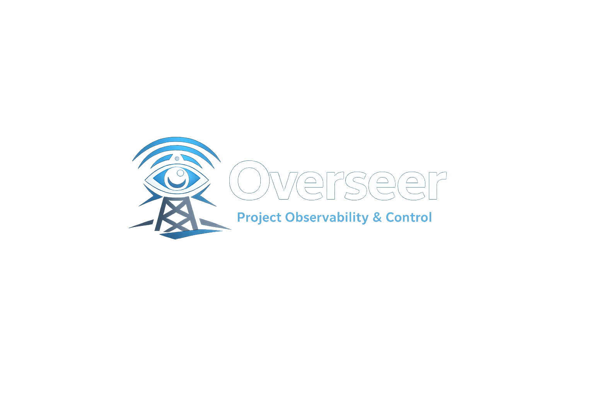

# Overseer

[](https://github.com/pykhaled/overseer/actions/workflows/ci.yml)



Overseer is a lightweight project observability and control service for Docker Compose applications.

Drop Overseer into your existing Docker Compose stack and instantly gain visibility into the services that make up your project.

Unlike container management tools that focus on the entire Docker host, Overseer focuses on a single application stack and provides a project-centric view of your services.

---

## Features

### Service Discovery

Automatically discovers services running under the same Docker Compose project.

### Service Control

- Start services
- Stop services
- Restart services

### Service Visibility

View:

- Running services
- Stopped services
- Container status
- Images
- Container identifiers
- Declared service dependencies as an interactive graph
- Project-level and per-service CPU and memory usage

### Project-Oriented

Overseer groups services by Docker Compose project, making it easier to understand and manage a complete application stack.

---

## Quick Start

Add Overseer to your existing `docker-compose.yml`.

```yaml
services:
  overseer:
    image: ghcr.io/pykhaled/overseer:latest
    restart: unless-stopped
    ports:
      - "8000:8000"
    volumes:
      - /var/run/docker.sock:/var/run/docker.sock
```

Start your stack:

```bash
docker compose up -d
```

Open:

```text
http://localhost:8000
```

Use the dashboard navigation to switch between the project overview at `/`, dependency graph at `/dependencies`, and container controls at `/services`. Selecting a service in the graph opens its matching control card.

---

## Example

```yaml
services:
  overseer:
    image: ghcr.io/pykhaled/overseer:latest

  api-gateway:
    image: my-api-gateway
    depends_on:
      - service-a
      - service-b

  service-a:
    image: my-service-a
    depends_on:
      - service-a-db

  service-a-db:
    image: postgres

  service-b:
    image: my-service-b
    depends_on:
      - service-b-db
      - redis

  service-b-db:
    image: postgres

  redis:
    image: redis
```

Overseer automatically discovers the services belonging to the project and uses declared `depends_on` relationships to render the architecture graph.

---

## Why Overseer?

Most Docker tools are host-centric.

Overseer is project-centric.

Instead of showing every container on the machine, Overseer helps you understand:

- What services belong to this application
- Which services are healthy
- Which services are consuming resources
- How services relate to one another

---

## Development

The production image uses Python 3.11. For local development, create a virtual environment, install the dependencies, and ensure a Docker daemon is available:

```bash
python3 -m venv .venv
source .venv/bin/activate
pip install -r requirements.txt
```

Run the Flask development server at `http://localhost:8000`:

```bash
python -m overseer
```

Run the automated test suite. Tests mock the Docker client and do not modify real containers:

```bash
python -m unittest discover -s tests -v
```

Run the production server locally with Gunicorn:

```bash
gunicorn --bind 0.0.0.0:8000 --workers 2 overseer:app
```

Build and run the container image:

```bash
docker build -t overseer .
docker run --rm -p 8000:8000 \
  -v /var/run/docker.sock:/var/run/docker.sock \
  overseer
```

See the [`docs/`](docs/README.md) directory for architecture, API, development, and deployment details.

---

## Roadmap

Planned features include:

- CPU and memory metrics
- Live logs
- Health checks
- Docker events stream
- Project metadata
- Multi-host support
- User authentication
- Alerting and notifications

---

## Security

Overseer requires access to the Docker socket:

```text
/var/run/docker.sock
```

This allows Overseer to inspect and manage Docker containers on the host.

Overseer has no built-in authentication and rejects lifecycle actions that do not include its CSRF header. Deploy it only as part of a trusted Compose project on a trusted network.

---

## License

MIT
